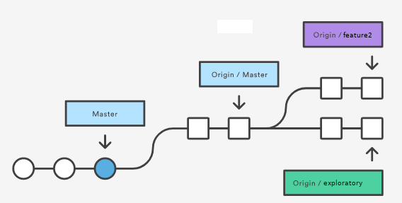
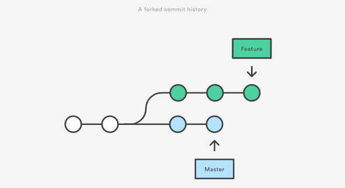
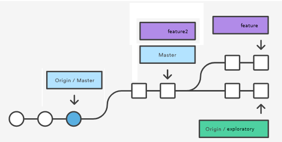

## Instructions for This Exercise


1. Create a repository on the local machine using the `create_demo_repo.sh`
script:

    ```bash
      create_demo_repo.sh  <repo_name>
    ```
    
    This creates a repository in the current working directory with whatever name
you choose as its only argument,  with a forked history and two branches,
one named `master` and one named  `feature1`.
For the rest of these instructions, we will assume that the name
of the repository that you created is `demo`.

2. If it is not open, start up your browser,
open GitHub, navigate to the class organization, and create an empty repository
named `<your-github-name>-git-exercise-04`.
On the page that is then displayed, choose the option
"`...or push an existing repository from the command line`"
and copy the command-line instructions for that option to your clipboard.

    > _These instructions only push up the `master` branch. That is all we want
to push for now. Although your local repository has a `feature1` branch, we pretend
that it is not ready to be pushed to the server._

3. Return to the terminal window open on your local machine and
make your working directory  the `demo` directory that you just created:

    ```bash
     cd demo
    ```
3. It is time to start up the Git visualization
tool that you installed on your machine. I will assume here that it is `gitg`,
the `Gnome` GUI client. In the command-line, type

    ```bash
     $ gitg &
    ```
    
    This starts it up and puts it in the background so that you can continue to
use the terminal. You can ignore the various warnings that it might display as
long as the window pops up and has meaningful content. (Or you can be a good
citizen and report the issue to the community.)
As you work, take a look at how the repository's history
changes. Before you go further, take a look at what it looks like and remember
it.

4. Paste the commands from the clipboard into the terminal window. In most
terminal emulators, Control-Shift-V does this. If this works, you will be
prompted to authenticate by whatever method you set up with `GitHub`, and then
your repository will be populated on GitHub with the history and files
of your `master` branch.


5. Return to the repository on GitHub and refresh the page if you do not see the
repository files automatically.

    > _The next two instructions will create a few commits on GitHub so that
your local  `master` branch will be "behind" the `origin/master`
__remote branch__. To do this, you will create two files on GitHub, put
some text into them and commit them. This will create two new commit objects
in the `master` branch of the __upstream__ associated with your local `demo`
repository._

6. [__Creating a file on GitHub__ ]
On GitHub click the __Create new file__ button, and name the file `gh_file1`.
In the editor window, type anything you want for the contents of the file,
scroll to the bottom of the screen, and click the green __Commit new file__ button.

7. Repeat the previous instruction but name this second file `gh_file2`.
    > _Now you will create a new feature branch on GitHub, not on your
local machine._

8. [__Creating a branch on GitHub__]
On GitHub, locate the button on the left-hand side of the screen that displays
the text "branch: master". Click that button once and a pop-up window will be
displayed that has an empty text box with the text "`find or create a branch`"
as well as a list of your repository's existing branches below it.
In that text box, type  `feature2`. Anothed small pop-up window will be displayed
with the text "`Create branch: feature2 from master`". Click the box.

9. Repeat the instructions in [__Creating a file on GitHub__ ] above, naming the
new file `feature2_file1`.

10. Repeat the instructions in [__Creating a file on GitHub__ ] above, naming the
new file `feature2_file2`.

    > _You now have a feature branch on GitHub that is ahead of the `master` branch on
GitHub by two commits. We want the structure of this upstream repository on
GitHub to  be a bit more complex, so you will now check out the `master` branch
on GitHub and create another  branch from it named `exploratory`._

11. Go back to the button that shows `branch:feature2`,
click on it, and select the `master` branch. If you do this correctly, the box
will show "`Branch: master`".

12. Follow the steps in [__Creating a branch on GitHub__] but name the branch
`exploratory`.

13. Create two new commits by adding two more files, using the instruction
above labeled  [__Creating a file on GitHub__ ] twice. Name your two files
`option1` and `option2`.

    > _The remote repository (on GitHub) now looks like the image below:_

    <center>
    
    
    <br>
    Image based on [Git Fetch](https://www.atlassian.com/git/tutorials/syncing/git-fetch)
    under a [Attribution 2.5 Australia (CC BY 2.5 AU)](https://creativecommons.org/licenses/by/2.5/au/) license.
    </center>
    

    > _You will now return to your local machine to use Git to do some work,
but before you do so,  make sure that you have read the slides
[Collaboration Workflow Basics](http://www.compsci.hunter.cuny.edu/~sweiss/course_materials/csci395.86/slides/collaborating_workflows.html)_.

14. Return to the terminal window open on your local machine and
make  sure that your working directory is still  the `demo` directory that you
created before.

    > _We will now simulate what happens when you and your team members have
been working independently. Although you just created a bunch of files yourself
on GitHub, this could have also been the result of your team members pushing
their own changes up to the common repository. That is how you should think
of it for now: the files and commits you made on GitHub are really the work
of others that took place concurrently with what you are about to do._

    > _You will now create a few more files in the `feature1` branch in your
repository. This simulates your working on your own on the feature branch that
is your task in this quest._

15. Check out the `feature1` branch in your repository:

    ```bash
      $ git checkout feature1
      Switched to branch 'feature1'
    ```
    
16. Write the following `bash` for-loop in your shell. After you type the first
line, `bash` will prompt you for the remaining lines with your
__secondary prompt string__, the `PS2` shell variable. It is usually "`-->`".
So when you see it, just type the second line, followed by the newline, 
then the third and so on, and type `done` on the last line:

    ```bash
      $ for i in 3 4 5 ; do
           echo "feature1_${i}" > feature1_${i}
           git add feature1_${i}
           git commit . -m "added feature1_${i}"
        done
    ```
    The result of this will be that you created three new files named `feature1_3`,
`feature1_4`, and `feature1_5`, with three new commits.

    > _Your `feature1` branch is now several commits ahead of the upstream
version of it on the GitHub server. You did some work and now you are confident
that you want to incorporate it into the project._

    > _Take a look at `gitg`'s window to see how it changed._

    > _You want to  pull down the work that has been done from the upstream, but
you will not use the `git pull` command to do this, as was explained in the
tutorial. You will use `git fetch`._

17. We fetch just the upstream `master` branch for now, the one that is _tracked_
by your local `master` branch, and the one that is known locally as
`origin/master`. Enter the following two commands. You will see messages from
Git that we will ignore for now.

    ```bash
      $ git checkout master
      Switched to branch 'master'
      $ git fetch origin master
    ```

18. Open the `gitg` window again and notice that it has added the commits
from the `master` branch on GitHub. But if you look at your working directory
it will not have the files `gh_file1` and `gh_file2` that you created.
__Fetching brings down the data from the upstream but it does not modify your
working directory. This is why it is safe__.

19. We will do a __fast-forward__ merge to move the `master` branch up to date
with `origin/master`. Enter:

    ```bash
      $ git merge origin/master
      Updating 4df383a..80b8cda
      Fast-forward
       gh_file1 | 1 +
       gh_file2 | 1 +
       2 files changed, 2 insertions(+)
       create mode 100644 gh_file1
       create mode 100644 gh_file2
    ```
20. Now look at your working directory with `ls` and see that the files are
there! The `merge` updates the working directory.

    > _Now it is time to integrate your work on the `feature1` branch with
the upstream changes in the `master` branch. But we will not use `merge`.
This is a perfect chance to practice rebasing._

    > _Conceptually, your feature branch and the master branch look like
the figure below._

    <center>
    
     
    
    </center>
   
    > _We will rebase the feature onto the updated master branch._

21. Enter the following commands

    ```bash
        $ git checkout feature1
        Switched to branch 'feature1'
        $ git rebase master
        First, rewinding head to replay your work on top of it...
        Applying: added feature1_1
        Applying: added feature1_2
        Applying: feature1_3
        Applying: feature1_4
        Applying: feature1_5
    ```

    > _The history that you see in `gitg` is now linear; your `feature` branch is
just a chain,  a few commits ahead of the `master` (and `origin/master`)
branch. Although you might be tempted, you are not supposed to move `master`,
because that implies that your `feature1` is merged into the project._

    > _The history now looks like this:_

    <center>
    
    
     
    </center>
    
     > _Suppose now that the team member who was responsible for developing
`feature2` contacts everyone and says that the version of `feature2` on the
server is final and can be merged into the `master` branch. She asks you if you
can do her the favor, since you already have the most recent `master` on your
local machine, of fetching the `feature2` branch and integrating it into your
local copy, after which it can be pushed back up to the upstream. You agree
to do this._

22. Your next step is to fetch that upstream `feature2` branch and merge it in.
We will use the `fetch/merge` approach to do this. We fetch the `feature2` branch:

    ```bash
      $ git fetch origin feature2
    ```
    Take a look at the `gitg` window and notice that the history is now forked
again, and that the `feature2` branch tip is two commits ahead of `master`.
Also, look at your working directory using `ls` and notice that the files
added in `feature2` are not there. All we did was fetch, not pull.

    > _Because `master` is an ancestor of `feature2` and not on a different part
of the tree, we can do a __fast-forward merge__ to integrate the feature into the
master branch. This will move the `master` branch so that it points to the same
commit as the `feature2` and it will also update the working directory._

23. We switch to the `master` branch to do a fast-forward merge:

    ```bash
      $ git checkout master
      Switched to branch 'master'
      $ git merge feature2
      Updating 80b8cda..c0c3627
      Fast-forward
       feature2_file1 | 1 +
       feature2_file2 | 1 +
       2 files changed, 2 insertions(+)
       create mode 100644 feature2_file1
       create mode 100644 feature2_file2
    ```
   
    > _Notice that Git added the two missing files. If youo look at `gitg` again (you
might have to refresh it or close and reopen it) you will see that `feature2`,
`origin/feature2`, and `master` all point to the same commit. However, `feature`
is no longer ahead of `master`; they are not on the same linear path. In other
words, `feature1` no longer is based on the most recent version of the `master`
branch._

    > _Our last task should be to fix this. We will rebase our `feature1` branch
on `master`._

24. Enter the following commands:

    ```bash
      $ git checkout feature1
      Switched to branch 'feature1'
      $ git rebase master
      First, rewinding head to replay your work on top of it...
      Applying: added feature1_1
      Applying: added feature1_2
      Applying: feature1_3
      Applying: feature1_4
      Applying: feature1_5
    ```
    Look at the working directory and look at the `gitg` window. The history is
once again linear and all files are present.

    > _Everything has been done. You can push these change back up to the server
if you like. If you want, you can fetch the `exploratory` branch if you just want
to inspect it. That is the last step of this activity._

25. Enter the following command:

    ```bash
      $ git fetch origin exploratory
    ```
    > _Since we are only inspecting and have no plans to integrate this work
into our repository, it is enough to just check out the new remote branch._

26. Enter the command:

    ```bash
      $ git checkout origin/exploratory
      Note: checking out 'origin/exploratory'.

      You are in 'detached HEAD' state. You can look around, make experimental
      changes and commit them, and you can discard any commits you make in this
      state without impacting any branches by performing another checkout.

      If you want to create a new branch to retain commits you create, you may
      do so (now or later) by using -b with the checkout command again. Example:

        git checkout -b <new-branch-name>

      HEAD is now at ec96968 Create option2
    ```
    By doing this we can examine the files, which _are_ in our working directory.
If we want to do any work and be able to make commits, we need to follow Git's
advice and create a new tracking branch, as follows._

27. Enter this (very last, really) command:

    ```bash
      $ git checkout  -b exploratory
      Switched to a new branch 'exploratory'
    ```
    Look at the `gitg` window and you will see the final state of the repository.
You might have to refresh or reload the window.

    > _The history now looks approximately like this, ignoring the number of
commits and missing a few branch names:_

    <center>
    
    
    
    </center>

