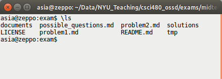

# OSSD Mini Exam 1

## Feb. 20, 2019

  
  

__Name__:
 \_\_\_\_\_\_\_\_\_\_\_\_\_\_\_\_\_\_\_\_\_\_\_\_\_\_\_\_\_\_\_\_\_\_\_\_\_\_\_\_\_\_\_\_\_\_\_\_\_\_\_\_\_\_\_\_\_\_\_\_\_\_\_
   
   
   
__NetID (the one in your email)__:    \_\_\_\_\_\_\_\_\_\_\_\_\_\_\_\_\_\_\_\_\_\_\_\_\_\_\_\_\_\_\_\_\_\_\_\_\_\_\_\_\_\_\_

  
  

Write your answers in the space provided below each problem. If you make
a mess, clearly indicate your final answer.

  
  
  
  
  
  
  
  
  
  
  
  

Do not open this booklet until instructed.

__Problem 1 (5 points)__

You are working with a local directory named `exam`  that contains several files and sub-directories. It's listing is given below.

Write a sequence of executable instructions that will create a git repository in the `exam` directory and then create the first commit
that contains all the files and subdirectories (their content included) except for the subdirectory `tmp`. The two subdirectories are
`documents` and `solutions`.

 
 
 
 
 
 
 
 
 
 
 
 
 
 
 
 
 
 

__Problem 2 (4 points)__

Explain, in your own words, the difference between  centralized and  decentralized models of version control systems.  

__Problem 3 (6 points)__

Consider a remote repository containing several files. Jane and John both have administrative access to that repository.
They both clone the repository and work with their local copies. Initially their local repositories are identical.

a. John creates a new file called `file_John.md`, adds it to his local repository and immediately pushes it to the remote.
  Jane creates a new file called `file_Jane.md`, adds it to her local repository and pushes it.
  Will there be a merge conflict when Jane attempts to make her push? Explain. If there is a merge conflict, describe how
  it should be resolved.

      
      
      
      
      
      
      
      
      
   

b. John and Jane both edit the existing file called `members` by adding their names to the list of existing names.  
  Will there be a merge conflict when each of them attempts to make their commit and  push? Explain.
  If there is a merge conflict, describe how it should be resolved.   

   
   
   
   
   

__Problem 4 (5 points)__

Complete each of the questions/statements with the missing term.

 

1. In order for any project to be open source it has to provide a ___________________________________.

  

2. In the talk _What is Open Source, and Why Should You Care?_ by Kevin Fleming that you watched at the beginning of the semester
he points out two non-code open source  projects that one could contribute to.   Name one of them: _____________________________.

3. Name three characteristics of a good issue report:

      
    - _____________________________,

      
    - _____________________________,

      
    - _____________________________.  
